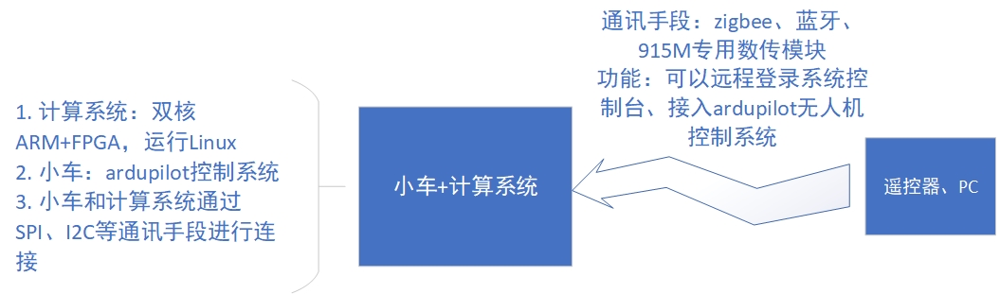

## 链接

 * [wiki page](http://os.cs.tsinghua.edu.cn/research/vanet/tdma2017)

## 系统结构说明

 1. 整套系统由计算系统和小车系统组成，整体逻辑结构如下图：

    

 2. 系统运行在Xilinx公司的Zynq SoC上，由双核700MHz ARM CPU和FPGA组成，CPU上运行完整版Linux，Linux和FPGA之间通过高速总线连接（AXI4）。

 3. 系统有一片高精度授时型GPS作为定位和时钟源，可以提供纳秒级的分布式时钟同步精度。

 4. 小车由pixhawk飞行控制器控制，运行全开源的ardupilot控制系统，可以根据预载入的GPS轨迹运行（通过专用数传模块建立电脑和控制器之间的连接），可以接受遥控器指令，也可以直接接受外部指令（由Linux系统控制）（注：计算系统和小车之间的连接通路目前还在实现中）

 5. 详细结构说明可以参考附加的文档：[系统详细说明文档](demo.pdf)

## 辅助工具的使用（tools目录下）

 1. 提供i2cgps和zigbee_uart_console工具，作用是对计算系统进行初始化（主要是GPS和通讯系统）和动态的配置。使用者可以使用计算机通过无线对小车和计算系统进行配置。

 2. i2cgps运行在计算系统的Linux中，zigbee_uart_console运行。通过zigbee建立电脑和计算系统之间的直接连接

    

## 程序编译

### 真实系统的代码编译说明

1. 总体说明：真实系统的代码编译分为两个部分：FPGA部分代码编译和Linux编译。FPGA部分利用xilinx vivado 16.2进行，windows或者ubuntu环境都可以。编译完FPGA代码后得到hdf文件。Linux部分使用petalinux工具集进行编译，其中会使用到FPGA编译后得到的hdf文件。

### FPGA部分代码编译

1. 环境：Ubuntu-16.04, Xilinx Vivavo 16.2
2. 启动vivado：
   1. sudo su
      1. source <path-to-vivado>/2016.2/settings64.sh
      2. vivado &
3. 在vivado中导入工程代码：
   1. 在界面左侧“IP Catalog”中加入两个IP核，分别是：
   2. real\axi_tdma_ath9k_middleware_project
   3. 这个IP核就是时隙接入的核心代码
   4. real\sendpkt_tester_1.0
   5. 这个IP核为FPGA-ping的测试核
      1. 导入zynq_pcie_16.2工程项目：real\zynq_pcie_16.2
      2. 综合得到hdf文件

### Linux的编译

1. 环境：Ubuntu-16.04
2. 安装petalinux-16.2：
   1. 下载地址（可能会变化）：https://www.xilinx.com/member/forms/download/xef.html?filename=petalinux-v2016.2-final-installer.run
      1. 运行安装文件安装petalinux
      2. 为zynq配置petalinux（这里是为了建立一个编译环境）：
   2. 将real\petalinux\pz_7015_2016_2.bsp 拷贝到ubuntu中
   3. 使用如下命令建立petalinux-create -t project -s <path-to-bsp>
   4. 将FPGA编译得到的hdf文件拷贝到目录下
   5. petalinux-config --get-hw-description=<path-to-hdf>
      1. 编译：
   6. petalinux-config -c rootfs
   7. petalinux-config -c kernel
   8. petalinux-build
   9. petalinux-package --boot --fsbl ./images/linux/zynq_fsbl.elf --fpga ./subsystems/linux/hw-description/root_complex_wrapper.bit --uboot --force

